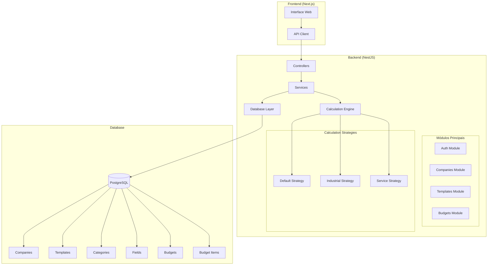
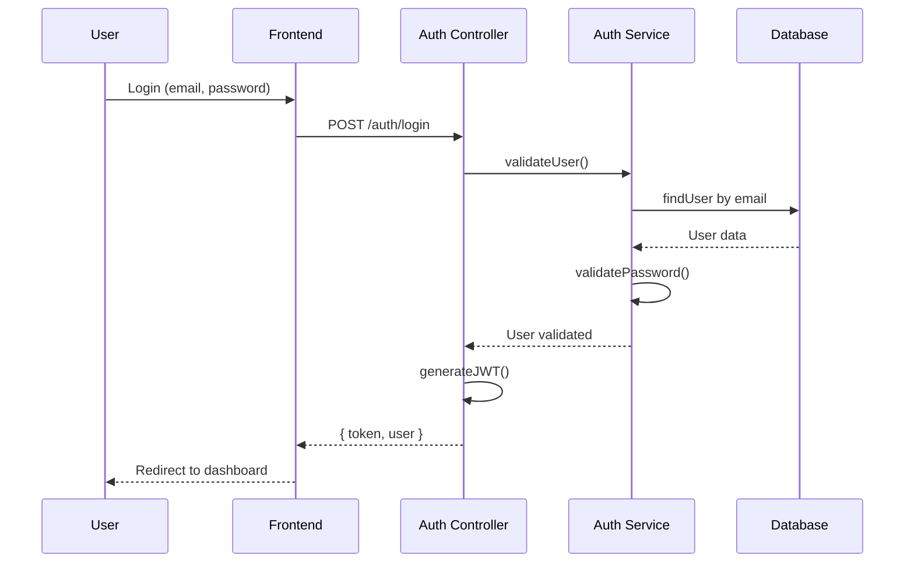
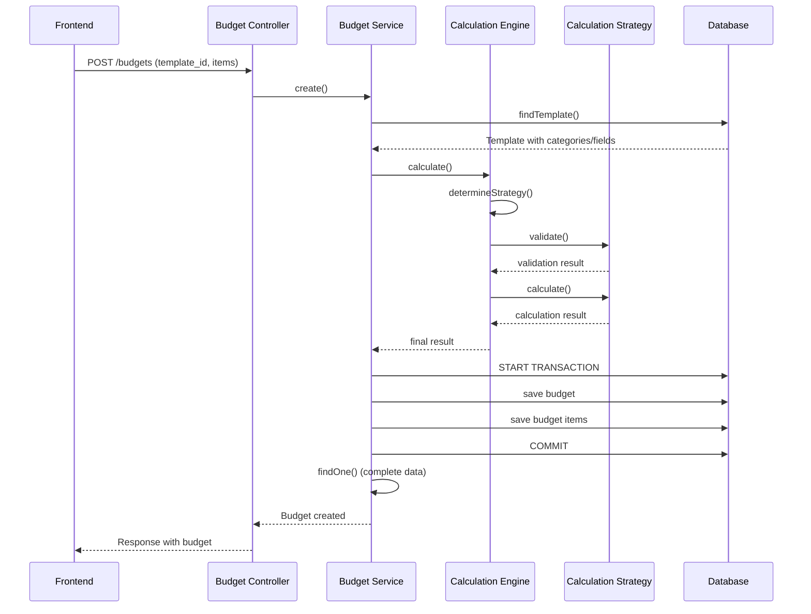
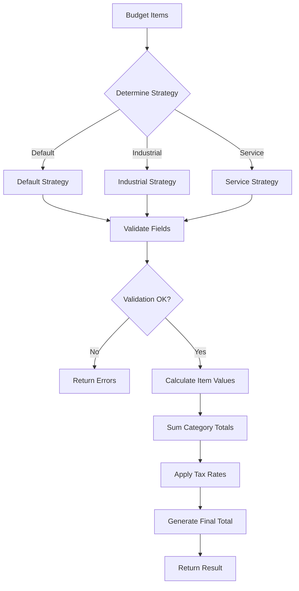
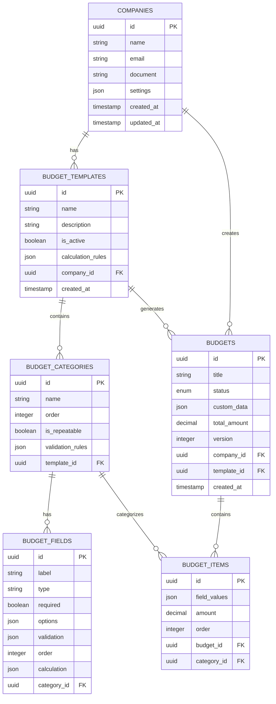

# 🏗️ OrcaPro Backend

Sistema backend completo para gestão de orçamentos desenvolvido com NestJS, TypeScript e PostgreSQL.

## 📋 Índice

- [Visão Geral](#visão-geral)
- [Arquitetura do Sistema](#arquitetura-do-sistema)
- [Fluxo de Funcionamento](#fluxo-de-funcionamento)
- [Tecnologias](#tecnologias)
- [Instalação](#instalação)
- [Configuração](#configuração)
- [Documentação da API](#documentação-da-api)
- [Sistema de Cálculos](#sistema-de-cálculos)
- [Estrutura do Banco de Dados](#estrutura-do-banco-de-dados)
- [Arquitetura de Módulos](#arquitetura-de-módulos)

## 🎯 Visão Geral

O OrcaPro Backend é uma API RESTful robusta que gerencia:

- 🔐 **Autenticação e autorização** com JWT
- 🏢 **Gestão de empresas** e usuários
- 📋 **Templates de orçamento** configuráveis
- 🧮 **Sistema de cálculos** com múltiplas estratégias
- 💰 **Orçamentos** com validação e persistência
- 📊 **Relatórios** e análises

## 🏛️ Arquitetura do Sistema



## 🔄 Fluxo de Funcionamento

### 1. Fluxo de Autenticação



### 2. Fluxo de Criação de Orçamento



### 3. Fluxo do Sistema de Cálculos



## 🛠️ Tecnologias

- **Framework**: NestJS 10.x
- **Linguagem**: TypeScript 5.x
- **Banco de Dados**: PostgreSQL 15+
- **ORM**: TypeORM 0.3.x
- **Autenticação**: JWT (Passport.js)
- **Validação**: class-validator, class-transformer
- **Documentação**: Swagger/OpenAPI

## ⚙️ Instalação

### Pré-requisitos

- Node.js 18+ 
- PostgreSQL 15+
- npm ou yarn

### Passos

1. **Clone o repositório**
```bash
git clone https://github.com/Bryannps/2BackOrcaPro.git
cd 2BackOrcaPro
```

2. **Instale as dependências**
```bash
npm install
```

3. **Configure o banco de dados**
```bash
# Crie um banco PostgreSQL
createdb orcapro_db
```

4. **Configure as variáveis de ambiente**
```bash
cp .env.example .env
# Edite o arquivo .env com suas configurações
```

5. **Execute as migrations**
```bash
npm run migration:run
```

6. **Execute os seeds (opcional)**
```bash
npm run seed:run
```

7. **Inicie o servidor**
```bash
# Desenvolvimento
npm run start:dev

# Produção
npm run build
npm run start:prod
```

## 🔧 Configuração

### Variáveis de Ambiente (.env)

```env
# Database
DB_HOST=localhost
DB_PORT=5432
DB_USERNAME=postgres
DB_PASSWORD=your_password
DB_DATABASE=orcapro_db

# JWT
JWT_SECRET=your_super_secret_jwt_key
JWT_EXPIRES_IN=7d

# Application
PORT=3001
NODE_ENV=development

# CORS
CORS_ORIGIN=http://localhost:3000
```

## 📚 Documentação da API

### Endpoints Principais

#### 🔐 Autenticação
```
POST /auth/register     # Registrar usuário
POST /auth/login        # Login
GET  /auth/profile      # Perfil do usuário
POST /auth/refresh      # Refresh token
```

#### 🏢 Empresas
```
GET    /companies       # Listar empresas
GET    /companies/:id   # Buscar empresa
PUT    /companies/:id   # Atualizar empresa
DELETE /companies/:id   # Deletar empresa
```

#### 📋 Templates
```
GET    /templates       # Listar templates
POST   /templates       # Criar template
GET    /templates/:id   # Buscar template
PUT    /templates/:id   # Atualizar template
DELETE /templates/:id   # Deletar template
```

#### 💰 Orçamentos
```
GET    /budgets         # Listar orçamentos
POST   /budgets         # Criar orçamento
GET    /budgets/:id     # Buscar orçamento
PUT    /budgets/:id     # Atualizar orçamento
DELETE /budgets/:id     # Deletar orçamento
POST   /budgets/calculate # Calcular orçamento
```

### Exemplo de Request/Response

#### Criar Orçamento

**Request:**
```json
{
  "template_id": "cf2941d1-b11f-4065-970b-7150a652422b",
  "title": "Orçamento Projeto X",
  "items": [
    {
      "category_id": "9358dfd3-592a-430e-a3f4-d9c12315f9f0",
      "field_values": {
        "78edb949-db9d-4d13-8650-98905285afdd": "Material A",
        "1b651f04-d72a-4118-85b7-f9bc646d4399": 100,
        "f4d10a5b-efec-46dc-936a-abdf40e5bc9f": "Observação"
      },
      "order": 0
    }
  ]
}
```

**Response:**
```json
{
  "success": true,
  "message": "Orçamento criado com sucesso",
  "data": {
    "id": "budget-uuid",
    "title": "Orçamento Projeto X",
    "status": "draft",
    "total_amount": 118.00,
    "custom_data": {
      "subtotals": {
        "Materiais": 100
      },
      "metadata": {
        "base_total": 100,
        "taxes": 18,
        "strategy_used": "default"
      }
    }
  }
}
```

## 🧮 Sistema de Cálculos

### Estratégias Disponíveis

#### 1. **Default Strategy**
- Cálculos básicos para orçamentos simples
- Soma valores por categoria
- Aplica taxa de imposto padrão (18%)

#### 2. **Industrial Strategy** 
- Cálculos específicos para projetos industriais
- Considera fatores de complexidade
- Margem de lucro diferenciada

#### 3. **Service Strategy**
- Voltado para orçamentos de serviços
- Cálculo baseado em horas/homem
- Custos operacionais inclusos

### Como Adicionar Nova Estratégia

1. **Crie a classe da estratégia:**
```typescript
@Injectable()
export class CustomStrategy implements ICalculationStrategy {
  readonly type = 'custom';

  async validate(template: BudgetTemplate, items: BudgetItemDto[]): Promise<ValidationResult> {
    // Implementar validação
  }

  async calculate(template: BudgetTemplate, items: BudgetItemDto[], context: CalculationContext): Promise<CalculationResult> {
    // Implementar cálculo
  }
}
```

2. **Registre no módulo:**
```typescript
@Module({
  providers: [
    // ... outras estratégias
    CustomStrategy,
  ],
})
export class BudgetsModule {}
```

3. **Registre no engine:**
```typescript
// calculation.engine.ts
private registerStrategies() {
  this.strategies.set('custom', this.customStrategy);
}
```

## 🗄️ Estrutura do Banco de Dados



## 🏗️ Arquitetura de Módulos

### Estrutura de Pastas
```
src/
├── modules/
│   ├── auth/              # Autenticação e autorização
│   │   ├── controllers/
│   │   ├── services/
│   │   ├── strategies/    # JWT, Local strategies
│   │   ├── guards/        # Auth guards
│   │   └── dto/          # Data Transfer Objects
│   │
│   ├── companies/         # Gestão de empresas
│   │   ├── controllers/
│   │   ├── services/
│   │   ├── entities/
│   │   └── dto/
│   │
│   ├── templates/         # Templates de orçamento
│   │   ├── controllers/
│   │   ├── services/
│   │   ├── entities/     # Template, Category, Field
│   │   └── dto/
│   │
│   └── budgets/          # Sistema de orçamentos
│       ├── controllers/
│       ├── services/
│       ├── entities/     # Budget, BudgetItem
│       ├── dto/
│       └── calculation/  # Engine de cálculos
│           ├── strategies/
│           ├── interfaces/
│           └── calculation.engine.ts
│
├── config/               # Configurações
├── database/            # Migrations e seeds
├── common/              # Utilitários compartilhados
└── shared/              # Módulos compartilhados
```

### Princípios Arquiteturais

- **Modular**: Cada funcionalidade é um módulo independente
- **SOLID**: Aplicação dos princípios SOLID
- **DRY**: Não repetição de código
- **Strategy Pattern**: Para o sistema de cálculos
- **Repository Pattern**: Abstração do acesso a dados
- **Dependency Injection**: Inversão de dependências

## 🚀 Deploy

### Docker (Recomendado)

```dockerfile
# Dockerfile
FROM node:18-alpine

WORKDIR /app

COPY package*.json ./
RUN npm ci --only=production

COPY . .

RUN npm run build

EXPOSE 3001

CMD ["npm", "run", "start:prod"]
```

### Docker Compose
```yaml
version: '3.8'
services:
  api:
    build: .
    ports:
      - "3001:3001"
    environment:
      - DB_HOST=db
      - DB_PORT=5432
      - DB_USERNAME=postgres
      - DB_PASSWORD=postgres
      - DB_DATABASE=orcapro_db
    depends_on:
      - db
      
  db:
    image: postgres:15
    environment:
      - POSTGRES_USER=postgres
      - POSTGRES_PASSWORD=postgres
      - POSTGRES_DB=orcapro_db
    volumes:
      - postgres_data:/var/lib/postgresql/data
      
volumes:
  postgres_data:
```

## 🧪 Testes

```bash
# Testes unitários
npm run test

# Testes e2e
npm run test:e2e

# Coverage
npm run test:cov
```

## 📈 Monitoramento

O sistema inclui:
- **Logs estruturados** com Winston
- **Health checks** para database e API
- **Métricas** de performance
- **Error tracking** com contexto completo

## 🤝 Contribuição

1. Fork o projeto
2. Crie uma branch (`git checkout -b feature/nova-feature`)
3. Commit suas mudanças (`git commit -am 'Add nova feature'`)
4. Push para a branch (`git push origin feature/nova-feature`)
5. Abra um Pull Request

## 📄 Licença

Este projeto está sob a licença MIT. Veja o arquivo [LICENSE](LICENSE) para detalhes.

## 👥 Equipe

- **Desenvolvedor Backend**: Bryan
- **Arquitetura**: Sistema modular com NestJS
- **Database**: PostgreSQL com TypeORM

---

🔗 **Links Relacionados:**
- [Frontend Repository](https://github.com/Bryannps/2FrontOrcaPro)
- [Documentação da API](http://localhost:3001/api/docs)
- [Postman Collection](./docs/postman-collection.json)